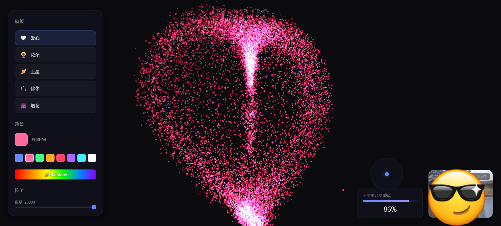

# 3D 粒子系统

基于 Three.js 和 MediaPipe Hands 的交互式 3D 粒子系统，支持手势控制和多种粒子效果。




## 运行

本项目为纯前端单文件应用，无需安装依赖或构建步骤。

直接在浏览器中打开 `index.html`，或使用本地服务器（摄像头手势功能需要 HTTPS 或 localhost）：

```bash
# 方式一：npx
npx serve .

# 方式二：Python
python -m http.server

# 方式三：VS Code Live Server 插件
```

## 功能

### 粒子模板

5 种预设形状，点击侧边栏按钮切换：

| 模板 | 说明 |
|------|------|
| ❤ 爱心 | 参数化心形曲面 |
| 🌻 花朵 | 五瓣玫瑰曲线 |
| 🪐 土星 | 球体 + 环形带 |
| ☯ 佛像 | 头部、身体、光晕组合 |
| 🎆 烟花 | 多中心径向爆发 |

### 颜色自定义

- **颜色选择器**：自由选取任意颜色
- **预设色块**：8 种常用颜色一键切换（蓝、粉、绿、橙、红、紫、青、白）
- **🌈 彩虹模式**：每个粒子根据自身位置分配不同色相，颜色随时间缓慢流动

### 手势交互

通过摄像头检测手部动作，实时控制粒子效果：

| 手势 | 效果 |
|------|------|
| ✋ 张开手掌 | 粒子向外爆炸扩散 + 螺旋扭转 + 冲击波纹 |
| ✊ 握紧拳头 | 粒子向心收缩 + 涡流旋绕 + 混沌湍流 |
| 👈 向左挥动 | 粒子整体向左推移 |
| 👉 向右挥动 | 粒子整体向右推移 |
| 👆 向上挥动 | 粒子整体向上推移 |
| 👇 向下挥动 | 粒子整体向下推移 |

- 张开/握拳程度由手指到手掌的平均距离计算
- 方向推动通过追踪手掌位置变化速度检测
- 所有效果可叠加：张开手掌的同时挥动，粒子会同时爆炸并向挥动方向推移

### 粒子数量

通过滑块调节粒子数量（2000 - 20000），实时生效。

## 界面元素

- **左侧边栏**：模板选择、颜色设置、粒子数量调节
- **右下角**：摄像头画面 + 手部检测状态
- **右下方**：手掌张开度进度条 + 方向指示器（圆形罗盘，实时显示推力方向）

## 技术栈

| 技术 | 用途 |
|------|------|
| Three.js v0.160.0 | 3D 渲染引擎 |
| MediaPipe Hands v0.4 | 手部关键点检测 |
| GLSL Shader | 粒子着色（顶点/片元着色器） |
| 原生 HTML/CSS/JS | 无框架，单文件 |

所有依赖通过 CDN 加载，无需安装。

## 项目结构

```
3D particle system/
├── index.html    # 完整应用（HTML + CSS + JS + GLSL，约 760 行）
└── README.md     # 说明文档
```

### index.html 代码结构

| 区域 | 说明 |
|------|------|
| `<style>` | 全部 CSS 样式（侧边栏、按钮、指示器等） |
| CONFIG | 全局常量（粒子数、物理参数、手势灵敏度） |
| THREE.JS SETUP | 场景、相机、渲染器初始化 |
| createParticles | 构建粒子几何体 + 自定义 ShaderMaterial |
| TEMPLATES | 5 种形状生成器（参数化数学函数） |
| ANIMATION | requestAnimationFrame 循环，物理模拟 |
| MEDIAPIPE HANDS | 摄像头手部追踪 + 手势识别 |
| UI | 侧边栏按钮、颜色选择器、滑块绑定 |

## 自定义

**修改物理参数**（CONFIG 区域）：

```javascript
const LERP_SPEED = 0.1;         // 动画插值速度（0-1，越大越快）
const EXPLOSION_STRENGTH = 8;   // 张手爆炸强度
const TURBULENCE_STRENGTH = 1.2; // 握拳湍流强度
const SWIPE_FORCE = 7;          // 方向挥动推力
const CONTRACT_STRENGTH = 5;    // 握拳收缩强度
const SPIRAL_STRENGTH = 3;      // 张手螺旋强度
```

**添加新模板**：

1. 在 TEMPLATES 区域的 `switch` 中添加新 `case`
2. 为每个粒子计算 `x, y, z` 坐标
3. 在 HTML 侧边栏添加对应按钮（`data-tpl` 属性匹配 case 名称）
